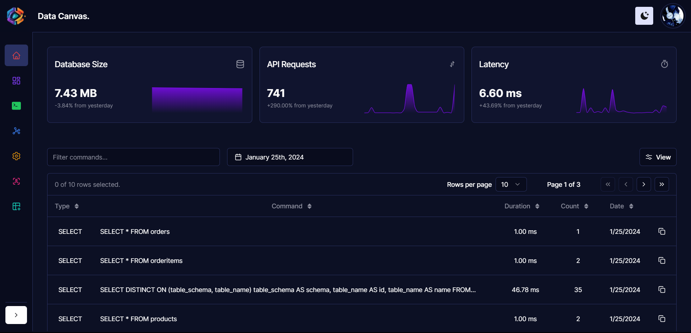
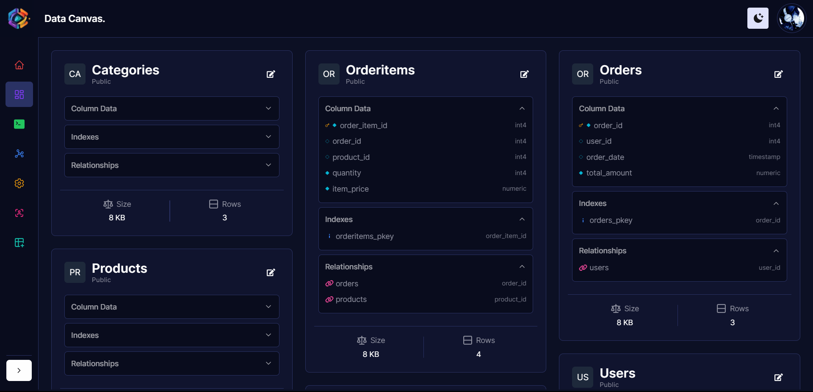
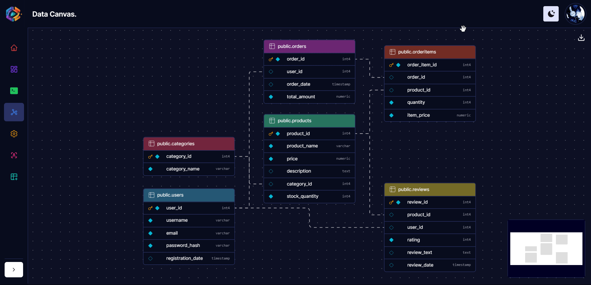
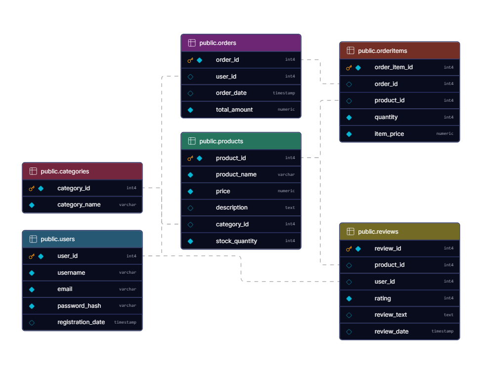
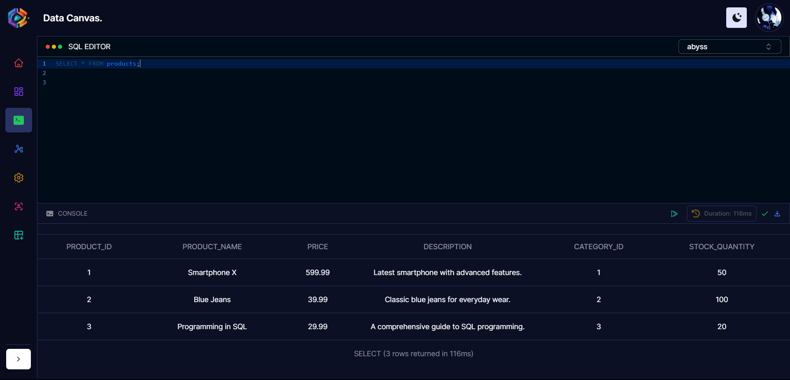
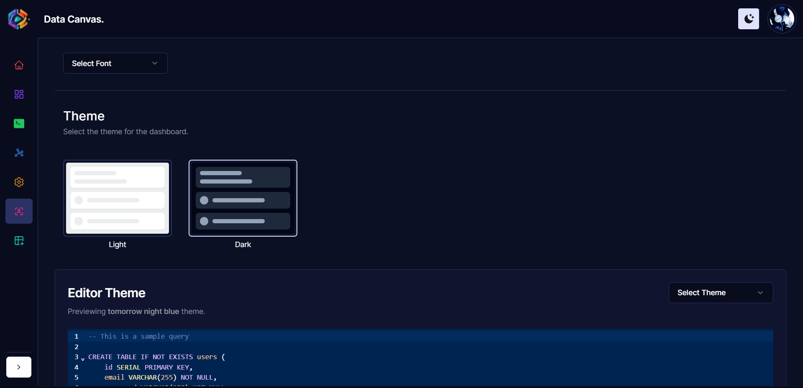

<p align="center"></p>
<h1 align="center">DATA CANVAS</h1>
<h4 align="center">A modern and responsive data visualization and management tool for the web</h4>

# Features

- [x] Modern and responsive UI
- [x] Real time user and database logs and statistics
- [x] Table Schema visualization and Management
- [x] Online `SQL` query editor
- [x] Graph Schema visualization
- [x] API credentials for external applications
- [x] Theme and Font customization
- [x] Table Data Visualization and Management
- [x] Export table data and schema as `CSV` and `PNG`

# Demo

Here is a video demo of the project:

https://github.com/FallenDeity/DataCanvas/assets/61227305/0f280a79-9601-4bc1-8ef8-b7b75fa50e49

# Screenshots

| Home Page | Table Schema |
| --- | --- |
|  |  |
| Graph Schema | Table Data |
|  |  |
| SQL Editor | Settings |
|  |  |

# Installation

## Manual

```bash
git clone https://github.com/FallenDeity/DataCanvas
cd DataCanvas
npm install
```

After installing the dependencies, you need to create a `.env` file in the root directory of the project and add the following variables:

```bash
GITHUB_ID=
GITHUB_SECRET=
GOOGLE_ID=
GOOGLE_SECRET=
EMAIL_SERVER_HOST=
EMAIL_SERVER_PORT=
EMAIL_SERVER_USER=
EMAIL_SERVER_PASSWORD=
EMAIL_SERVER_CLIENT_ID=
EMAIL_SERVER_CLIENT_SECRET=
EMAIL_SERVER_REFRESH_TOKEN=
EMAIL_FROM=
NEXTAUTH_URL=
NEXTAUTH_SECRET=
NEXT_PUBLIC_BASE_URL=
DATABASE_USER=
NEXT_PUBLIC_DATABASE_HOST=
NEXT_PUBLIC_DATABASE_PORT=
DATABASE_URL=
```

Project requires a `PostgreSQL` database to run. You can either use a local database or a remote one. If you are looking for a free remote database, you can use the following services:

- [ElephantSQL](https://www.elephantsql.com/)
- [Render](https://render.com/)

After setting up the database, you need to run the sql file present in `src/bin/tables.sql` to create the required tables. You can use the following command to run the sql file:

```bash
psql -U <username> -d <database_name>
\i ./src/bin/tables.sql
```

Finally, you can run the project with the following command:

```bash
npm run start
```

## Docker

The project can also be run using `docker-compose`. To run the project using `docker-compose`, you need to create a `.env` file in the root directory of the project and add above mentioned variables.

Set the following additional variables in the `.env` file:

```bash
PGPASSWORD= # Database password
PGDATABASE= # Database name
```

This is required to spin up the database container. You don't need to create the database manually as it will be created automatically by the database container.

To run the project using `docker-compose`, you can use the following command:

```bash
docker compose up production --build
```

To create the required tables, you can use the following command:

```bash
cat ./src/bin/tables.sql | docker exec -i datacanvas_db psql -U <DATABASE_USER> -d <PGDATABASE>
```

# Contributing

Contributions are always welcome! Feel free to open any issues or send pull requests.
